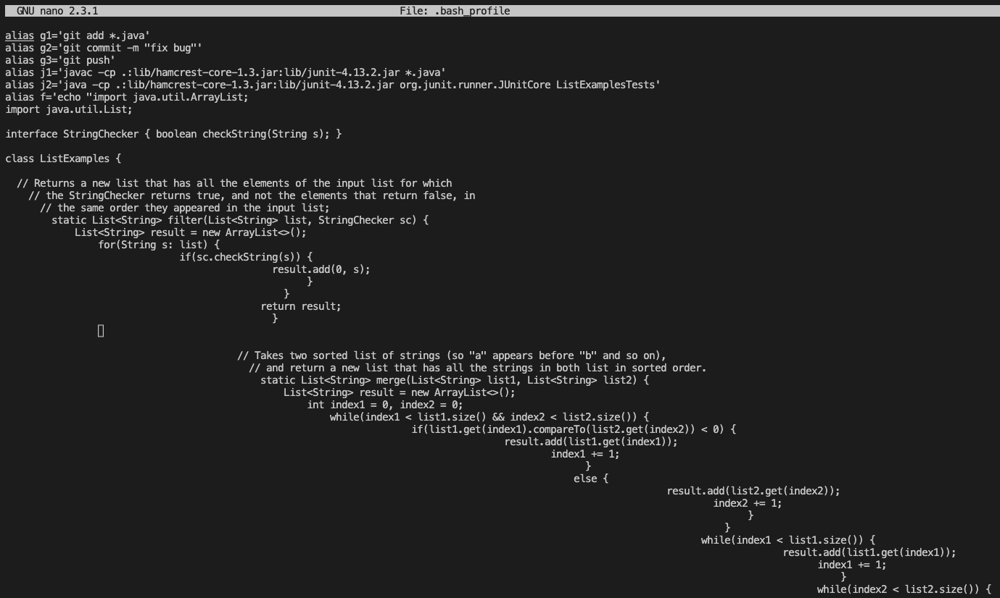
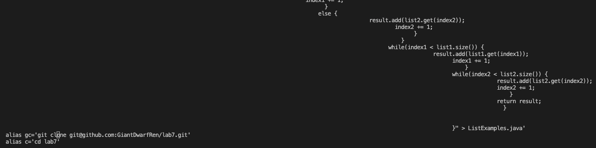

# Lab Report 4
## set up before start
Note, I won the champion of "done quick" competition. TA said no bash script, but I used `alias` to help me run command quick. I demostrated how I did to TAs and after discussion they accepted me using `alias`. 
`alias` is a tool in command line that can create personal command short cuts to run complex command. 
I added alias in `.bash_profile`, a file that will run when starting bash. Thus, each time I connected to the remote ieng6, I can use my customize command. 
Type in `alias` can show all added `alias`. But here I used `nano .bash_profile` to show my alias.
 

I'll explain each `alias` in each step. 
## Step 4
