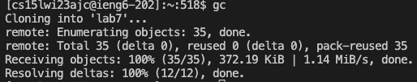

# Lab Report 4
## set up before start
Note, I won the champion of "done quick" competition. TA said no bash script, but I used `alias` to help me run command quick. I demostrated how I did to TAs and after discussion they accepted me using `alias`. 

`alias` is a tool in command line that can create personal command short cuts to run complex command. 

I added alias in `.bash_profile`, a file that will run when starting bash. Thus, each time I connected to the remote ieng6, I can use my customize command. 

Type in `alias` can show all added `alias`. But here I used `nano .bash_profile` to show my alias.

 


I'll explain each `alias` in each step. 

## Overview
Here is the overview of commands that I typed to complete tasks.
```
<^R>ssh <enter>
gc
c
j1
j2
f
j1
j2
g1
g2
g3
```

## Step 4
Thanks to adding public key to ieng6, I can directly log in from my terminal without password. 

I run the following command to quickly log in:`<^R>ssh <enter>`

`<^R>` stands for "ctrl+R". It's a terminal search command. By typing in "ssh ", it would search historical command containning "ssh ". In my command line history, there is only one match: "ssh cs15lwi23ajc@ieng6.ucsd.edu". By hitting `<enter>`, it will run that command, saving me much more time.


## Step 5
I typed `gc` to clone the repo. I defined `gc` in my .bash_profile as: `alias gc='git clone git@github.com:GiantDwarfRen/lab7.git'`. Running `gc` in my ieng6 is equal to running `git clone git@github.com:GiantDwarfRen/lab7.git`. This saves me lot of time. 



## Step 6
First, `cd` to `lab7/`. I also define a quick command `c` for that. `alias c='cd lab7'` 


To quickly run the test, I also define two command `j1` and `j2`. 
```
alias j1='javac -cp .:lib/hamcrest-core-1.3.jar:lib/junit-4.13.2.jar *.java'
alias j2='java -cp .:lib/hamcrest-core-1.3.jar:lib/junit-4.13.2.jar org.junit.runner.JUnitCore ListExamplesTests'
```
`j1` will compile all java files. `j2` will execute `ListExamplesTests` test class.


## Step 7
To fix bug, I define `f` to replace all code in original .java file with corrected version. `f` is defined as 

`alias f='echo "<corrected code>" > ListExamples.java`


## Step 8
Recompile and rerun the test, using `j1` and `j2`. Similar to *step 6*.


## Step 9
I defined `g1`, `g2`, and `g3` to add, commit, and push changes to GitHub.

These shortcuts are defined as:
```
alias g1='git add *.java'
alias g2='git commit -m "fix bug"'
alias g3='git push'
```
`g1` will add all changed .java files. `g2` will commit with message "fix bug". And `g3` will push to *main*.

